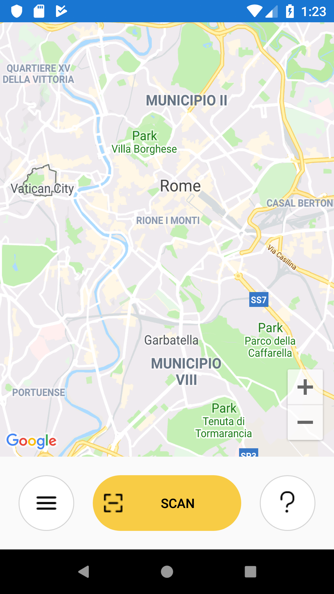
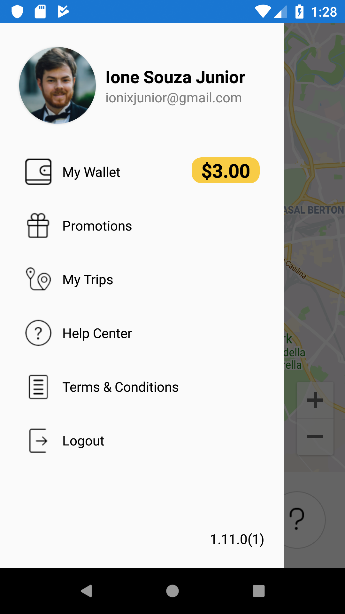
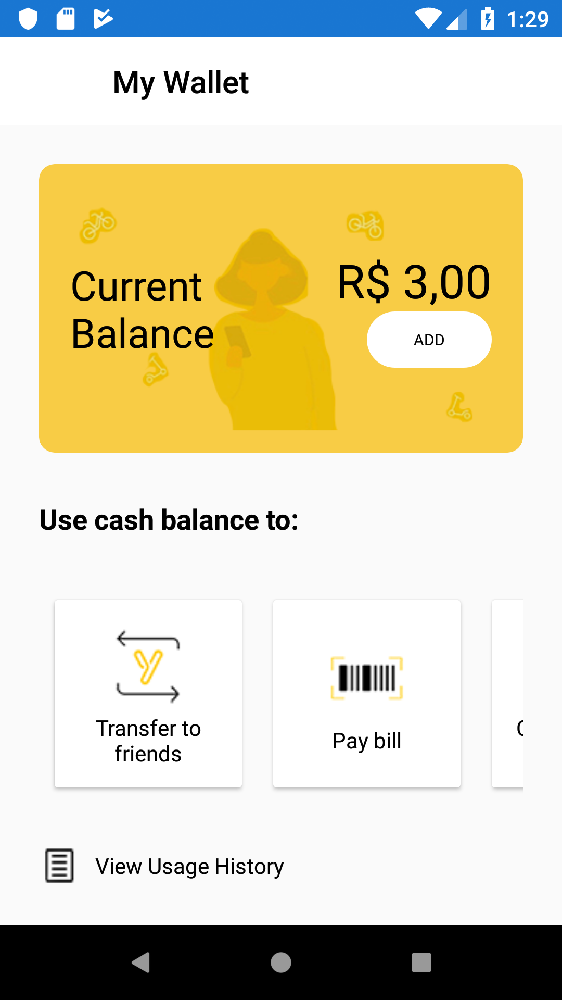
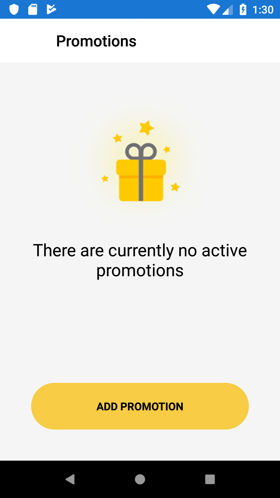
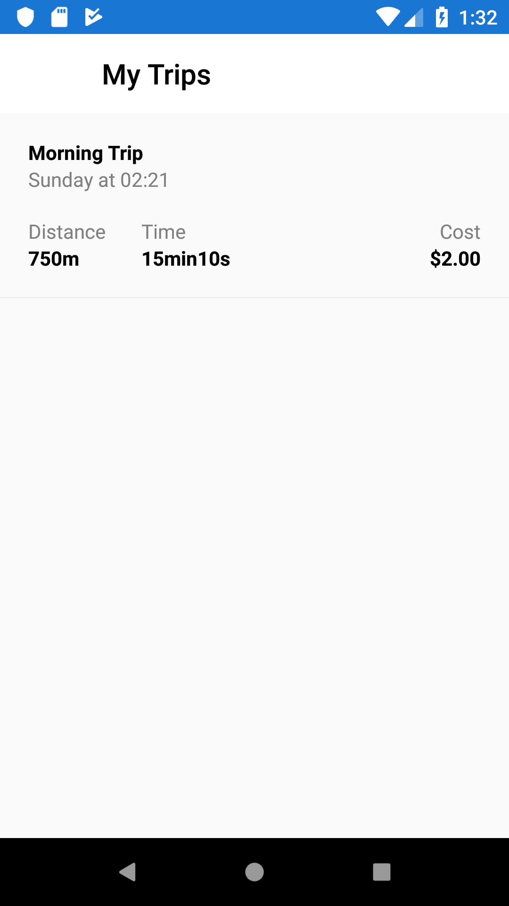
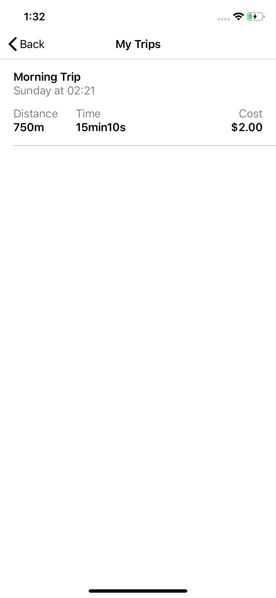

# Yellow App Clone

App feito com Xamarin.Forms para a talk "**O Poder do XAML, criando interfaces incríveis!**". 

Link da live - Parte I https://www.youtube.com/watch?v=x_sNPEwS3kA

Alguns prints do app:

#### Map

 

#### Menu

 

#### My Wallet

 

#### Promotions

 

#### My Trips

 