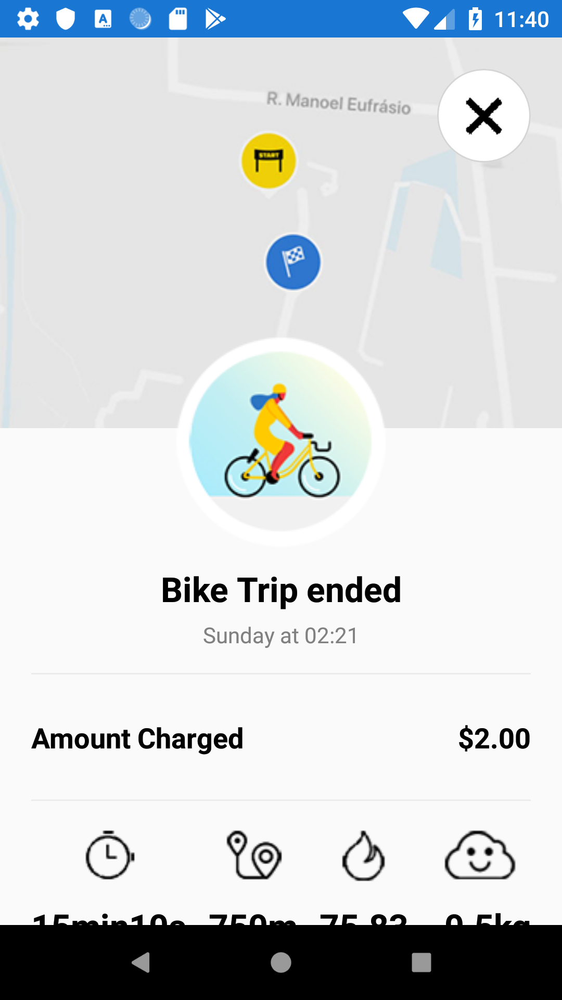
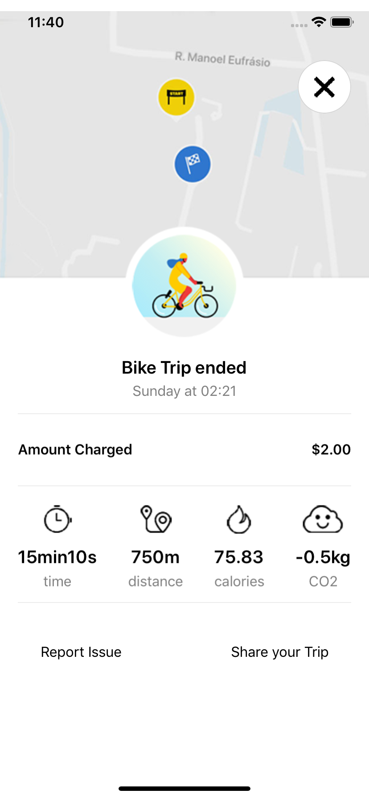
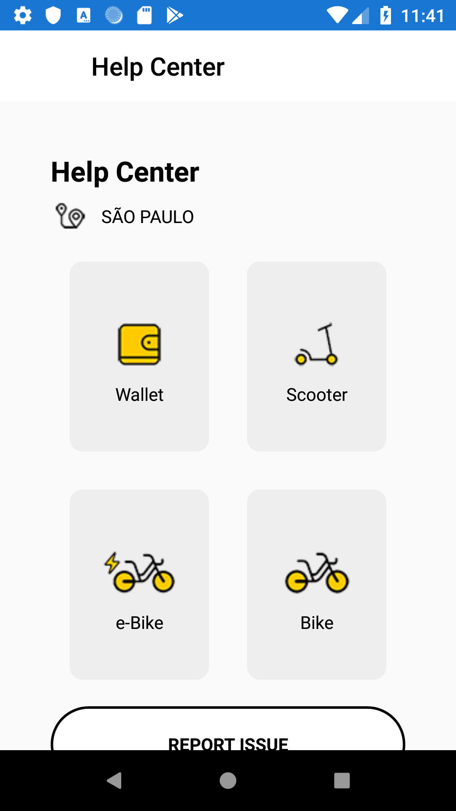
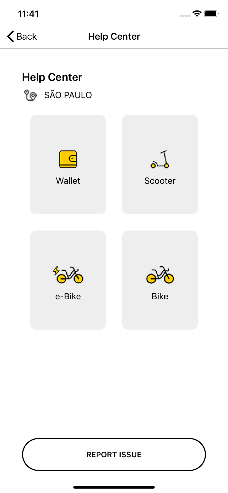

# Yellow App Clone

App feito com Xamarin.Forms para a talk "**O Poder do XAML, criando interfaces incríveis!**". 

#### Link das lives

##### Criação do app com Xamarin.Forms
Parte I https://www.youtube.com/watch?v=x_sNPEwS3kA

Parte II https://www.youtube.com/watch?v=k3oediCzZvs

##### Migração do app para MAUI
Playlist com as lives da migração https://www.youtube.com/playlist?list=PLAbYWcQD84aM4SLG32GymHLzi_Xrh2S7d

Alguns prints do app:

#### Map

 

#### Menu

 

#### My Wallet

 

#### Promotions

 

#### My Trips

 

#### Trip details

 

#### Help Center

 